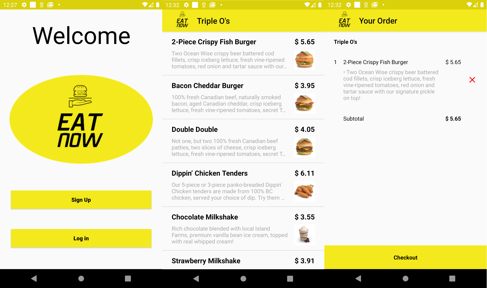
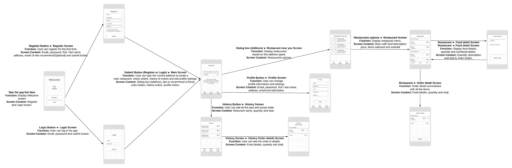
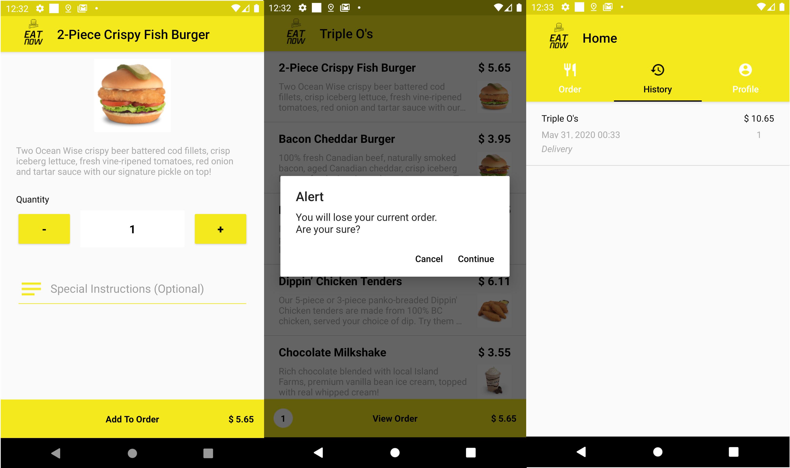
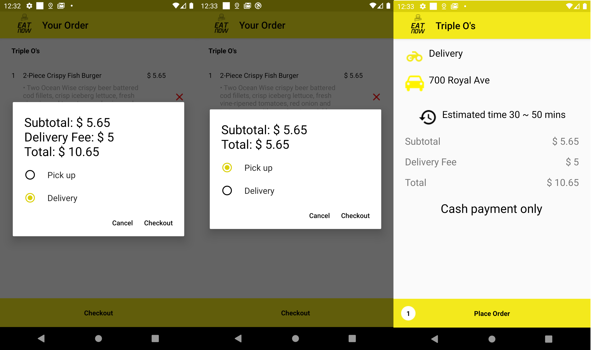

### Repository
[Eat NOW](https://github.com/Fershark/eatNow-csis3175)

### Overview

The goal of the project is to develop an Android app on Food Ordering System which is designed to order the food online from a
restaurant (near you) of your choice via the mobile app. This was my final project in Douglas College Introduction to Mobile Development.

### Team
- Raphael Tomohiko Yamada
- David Araújo
- Fernando Chavez Riquelme

### Role
- Team Leader
- Developer
- UX Designer
- Project Manager

### Tools used
- wireframe.cc
- Git
- Android Studio

### Features
- Launch Screen
- Local DB managed with Room Persistance Library
- Proximity calcutation with Latitude and Longitude
- Google geocoder to get the Latitude/Longitude from an address
- Customized buttons and tabs

